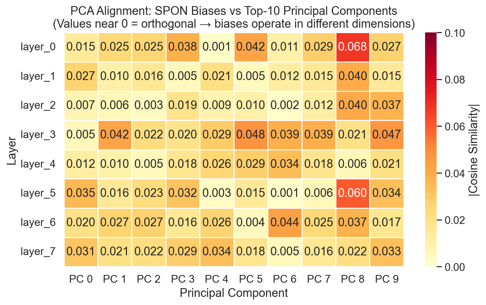
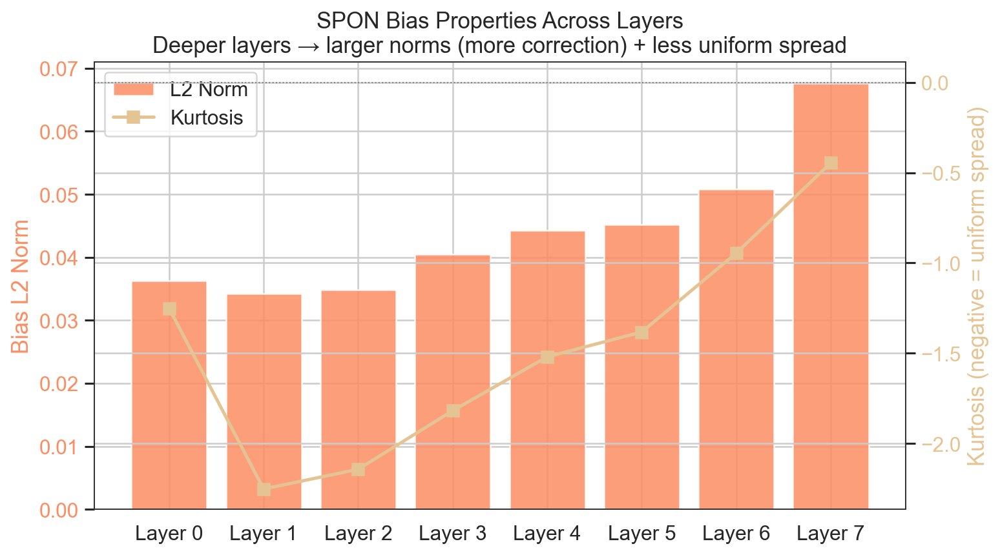
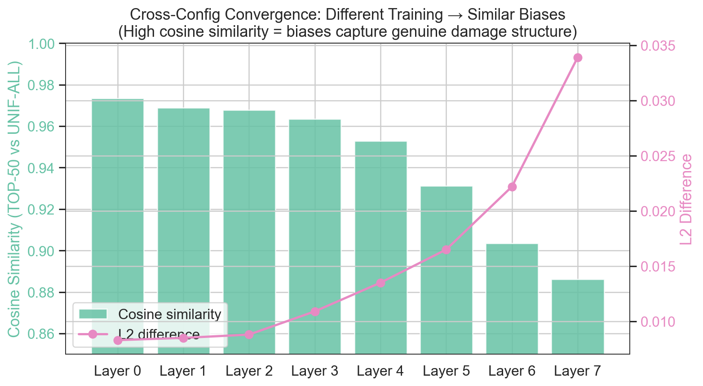

# SPON Extensions: Experimental Findings

Hetansh Waghela | February 2026

Independent reproduction and extension of "Resting Neurons, Active Insights" (Xu et al., arXiv:2512.12744v1).

---

## Setup

- **Model**: Llama-3.2-1B (16 transformer layers, hidden dim 2048)
- **Hardware**: NVIDIA A100-SXM4-80GB, CUDA 12.6, PyTorch 2.9.0
- **Calibration data**: WikiText-103 (train split), 2048 samples, block size 128
- **Evaluation data**: WikiText-103 (test split), 1024 samples
- **Training**: 10 epochs, lr=1e-5, batch size 8, KL divergence distillation
- **Sparsity levels tested**: 50%, 60%
- **Configurations tested**: 6 allocation strategies × 2 sparsity levels = 12 runs total
- **Total runtime**: ~37 minutes on A100

---

## Experiment 1: Layer-wise and Module-wise SPON Allocation Sweep

### Baselines

| Condition | Perplexity |
|-----------|-----------|
| Dense (no sparsification) | 21.64 |
| TEAL-only on down_proj @ 50% sparsity | 22.60 |
| TEAL-only on down_proj @ 60% sparsity | 23.93 |
| TEAL-only on o_proj @ 50% sparsity | 22.19 |
| TEAL-only on o_proj @ 60% sparsity | 22.73 |

### Results Overview

All MLP-based configs (UNIF-ALL, TOP-50, TOP-75, BOTTOM-50) sparsify `down_proj` and are compared against the down_proj TEAL baseline. ATTN-ONLY sparsifies `o_proj` and is compared against the o_proj TEAL baseline. Comparisons are module-matched.


### Results at 50% Sparsity

| Config | Layers | SPON Params | Perplexity | vs TEAL | vs Dense |
|--------|--------|-------------|-----------|---------|----------|
| BASELINE-TEAL | 0 | 0 | 22.60 | -- | +4.4% |
| UNIF-ALL | 16 | 32,768 | 22.38 | -0.97% | +3.4% |
| TOP-75 | 12 | 24,576 | 22.41 | -0.85% | +3.6% |
| TOP-50 | 8 | 16,384 | 22.42 | -0.82% | +3.6% |
| BOTTOM-50 | 8 | 16,384 | 22.47 | -0.59% | +3.8% |
| ATTN-ONLY | 16 | 32,768 | 21.75 | -2.01% | +0.5% |

### Results at 60% Sparsity

| Config | Layers | SPON Params | Perplexity | vs TEAL | vs Dense |
|--------|--------|-------------|-----------|---------|----------|
| BASELINE-TEAL | 0 | 0 | 23.93 | -- | +10.6% |
| UNIF-ALL | 16 | 32,768 | 23.40 | -2.23% | +8.1% |
| TOP-50 | 8 | 16,384 | 23.44 | -2.02% | +8.3% |
| TOP-75 | 12 | 24,576 | 23.46 | -1.95% | +8.4% |
| BOTTOM-50 | 8 | 16,384 | 23.62 | -1.31% | +9.1% |
| ATTN-ONLY | 16 | 32,768 | 21.89 | -3.73% | +1.1% |

### Key Finding 1: Attention o_proj benefits substantially more from SPON than MLP down_proj

The original SPON paper focuses exclusively on MLP `down_proj` as the sparsification and SPON injection site. We tested `o_proj` (the output projection of attention) and found it responds much more strongly to SPON correction.


| Module | Sparsity | TEAL PPL | SPON PPL | Dense PPL | Damage Recovered |
|--------|----------|----------|----------|-----------|-----------------|
| down_proj | 50% | 22.60 | 22.38 (UNIF-ALL) | 21.64 | 23% |
| o_proj | 50% | 22.19 | 21.75 (ATTN-ONLY) | 21.64 | 80% |
| down_proj | 60% | 23.93 | 23.40 (UNIF-ALL) | 21.64 | 23% |
| o_proj | 60% | 22.73 | 21.89 (ATTN-ONLY) | 21.64 | 77% |

At 60% sparsity, SPON on `o_proj` recovers 77% of the sparsification damage, compared to only 23% for `down_proj`. ATTN-ONLY at 60% sparsity (21.89) achieves perplexity within 1.1% of the fully dense model despite zeroing 60% of activations.

Note: `o_proj` sparsification causes less baseline damage than `down_proj` (22.19 vs 22.60 at 50%), so the two module types are not directly interchangeable. The finding is that SPON biases are far more effective at correcting attention output distortions than MLP output distortions.

### Pareto-Optimal Configurations


The Pareto frontier (best trade-off between parameter count and perplexity) at 50% sparsity consists of: BASELINE-TEAL, TOP-50, TOP-75, UNIF-ALL, and ATTN-ONLY.

TOP-50 achieves 85% of UNIF-ALL's improvement with only 50% of the SPON parameters, making it the most parameter-efficient MLP-based configuration.

### Key Finding 2: Early layers ("top") benefit more from SPON

Comparing TOP-50 (layers 0-7, closer to input) versus BOTTOM-50 (layers 8-15, closer to output):

| Sparsity | TOP-50 Improvement | BOTTOM-50 Improvement | Ratio |
|----------|--------------------|-----------------------|-------|
| 50% | 0.82% | 0.59% | 1.39x |
| 60% | 2.02% | 1.31% | 1.54x |

Early layers consistently benefit more, and the advantage widens at higher sparsity. This is consistent with the paper's claim that top layers are more sensitive to sparsification and therefore benefit more from SPON correction.

### Key Finding 3: Diminishing returns from additional SPON layers

TOP-50 (8 layers, 16K params) achieves 85% of UNIF-ALL's (16 layers, 32K params) improvement at 50% sparsity. TOP-75 (12 layers, 24K params) is only marginally better than TOP-50. The marginal value of each additional SPON layer decreases rapidly, suggesting a cost-effective deployment would target roughly the top 50% of layers.

### Key Finding 4: SPON effectiveness scales with sparsity

All configurations show larger improvements at 60% than at 50%. For example, UNIF-ALL improves from 0.97% to 2.23%, and ATTN-ONLY from 2.01% to 3.73%. This confirms the paper's prediction that SPON becomes more valuable as sparsification damage increases.

---

## Experiment 2: Mechanistic Interpretability Analysis

Analyzed the TOP-50 checkpoint at 50% sparsity, with UNIF-ALL used for cross-configuration comparison.

### Analysis 1: PCA Alignment of SPON Biases

We computed the cosine similarity between each layer's SPON bias vector and the top 10 principal components of that layer's hidden-state activations (collected over 25 diverse prompts).



| Layer | Max PC Alignment | Best PC |
|-------|------------------|---------|
| layer_0_down_proj | 0.068 | PC 8 |
| layer_1_down_proj | 0.040 | PC 8 |
| layer_2_down_proj | 0.040 | PC 8 |
| layer_3_down_proj | 0.048 | PC 5 |
| layer_4_down_proj | 0.034 | PC 6 |
| layer_5_down_proj | 0.060 | PC 8 |
| layer_6_down_proj | 0.044 | PC 6 |
| layer_7_down_proj | 0.034 | PC 4 |

All alignment values are below 0.07, indicating that SPON biases are approximately orthogonal to the principal components of hidden-state variance. SPON corrections operate outside the dominant subspace of representations, suggesting they target fine-grained distortions that PCA-based analysis would miss entirely.

### Analysis 2: Category-Specific Representation Shifts

We measured L2 representation shifts and CKA similarity between dense and sparse+SPON states across five prompt categories.

| Category | Avg L2 Shift | Avg CKA |
|----------|-------------|---------|
| Math | 0.179 | 0.9997 |
| Commonsense | 0.188 | 0.9996 |
| Coding | 0.183 | 0.9997 |
| Safety | 0.180 | 0.9996 |
| Factual | 0.184 | 0.9998 |

Two observations:

1. CKA scores are uniformly above 0.999 across all categories and layers. SPON preserves the geometric structure of representations while applying magnitude-level corrections.

2. All five categories show nearly identical shift magnitudes (range: 0.179-0.188). SPON corrections are category-agnostic at this sparsity level, applying a uniform structural correction rather than content-dependent adjustments.

### Analysis 3: SPON Bias Statistics



| Layer | L2 Norm | Std Dev | Max Abs | Kurtosis | Pos Fraction |
|-------|---------|---------|---------|----------|-------------|
| layer_0 | 0.036 | 0.0008 | 0.0072 | -1.25 | 0.505 |
| layer_1 | 0.034 | 0.0008 | 0.0028 | -2.25 | 0.503 |
| layer_2 | 0.035 | 0.0008 | 0.0032 | -2.14 | 0.490 |
| layer_3 | 0.041 | 0.0009 | 0.0033 | -1.82 | 0.499 |
| layer_4 | 0.044 | 0.0010 | 0.0037 | -1.52 | 0.500 |
| layer_5 | 0.045 | 0.0010 | 0.0041 | -1.38 | 0.493 |
| layer_6 | 0.051 | 0.0011 | 0.0047 | -0.95 | 0.499 |
| layer_7 | 0.068 | 0.0015 | 0.0061 | -0.45 | 0.501 |

Observations:

- Bias norms increase monotonically with depth (0.034 at layer 1 to 0.068 at layer 7), a 2x increase across the network. Deeper layers require larger corrections.
- Near-zero means and approximately 50/50 positive-negative splits indicate the biases are symmetric corrections, not simple additive offsets.
- Uniformly negative kurtosis (platykurtic distributions) means the correction values are more uniformly spread than a Gaussian. SPON applies distributed, broad-spectrum corrections rather than sparse, targeted spikes.
- Kurtosis becomes less negative with depth (-2.25 at layer 1 to -0.45 at layer 7), indicating deeper layers develop more peaked, concentrated corrections.

### Analysis 4: Hidden-State Shift Quantification

This analysis replicates the spirit of Figure 3 from the SPON paper. We measured the L2 distance between dense hidden states and both TEAL-only (sparse, no SPON) and SPON (sparse + biases) hidden states at each layer.


| Layer | TEAL Shift (L2) | SPON Shift (L2) | Recovery % |
|-------|-----------------|-----------------|------------|
| layer_0 | 0.037 | 0.053 | -40.5% |
| layer_1 | 0.076 | 0.089 | -17.4% |
| layer_2 | 0.118 | 0.128 | -8.7% |
| layer_3 | 0.186 | 0.196 | -5.8% |
| layer_4 | 0.224 | 0.231 | -3.5% |
| layer_5 | 0.239 | 0.248 | -3.7% |
| layer_6 | 0.246 | 0.252 | -2.4% |
| layer_7 | 0.256 | 0.266 | -3.8% |
| **Average** | **0.173** | **0.183** | **-10.7%** |

### Key Finding 5: SPON improves outputs by perturbing intermediate representations, not by restoring them

The negative recovery percentages across all layers reveal that SPON biases make intermediate hidden states more different from the dense model, not less. Despite this, SPON substantially improves the final output perplexity (as shown in Experiment 1).

This apparent paradox is resolved by the training objective. SPON biases are optimized via KL divergence on the model's final logit distribution — there is no intermediate representation matching loss. The biases are therefore free to reroute information through the sparse network in whatever way minimizes output-level discrepancy, even if that means individual layers diverge further from their dense counterparts.

This finding has implications for interpreting SPON: the biases should not be understood as layer-local damage repair. Instead, they implement a distributed, end-to-end correction strategy where each layer's bias coordinates with the others to optimize the final prediction. This is consistent with growing evidence in mechanistic interpretability that individual layer representations can be misleading when analyzed in isolation (cf. logit lens limitations).

The negative recovery is most pronounced in early layers (-40.5% at layer 0) and attenuates with depth (-2.4% at layer 6), suggesting that early-layer biases introduce the largest deliberate perturbations which are then refined by later layers.

### Analysis 5: Layer-wise Bias Norm Ranking

Layers ranked by SPON bias L2 norm (most to least correction needed):

1. layer_7_down_proj: 0.068
2. layer_6_down_proj: 0.051
3. layer_5_down_proj: 0.045
4. layer_4_down_proj: 0.044
5. layer_3_down_proj: 0.041
6. layer_0_down_proj: 0.036
7. layer_2_down_proj: 0.035
8. layer_1_down_proj: 0.034

The ranking is nearly monotonically increasing with depth (with a minor inversion at layer 0). This confirms that deeper layers in the network sustain more sparsification damage and require proportionally larger SPON corrections.

### Analysis 6: Cross-Configuration Bias Comparison

We compared the SPON biases learned by TOP-50 (8 layers, 16K params) against UNIF-ALL (16 layers, 32K params) for their shared layers (0-7).



| Layer | Cosine Similarity | L2 Difference |
|-------|-------------------|---------------|
| layer_0 | 0.973 | 0.008 |
| layer_1 | 0.969 | 0.009 |
| layer_2 | 0.968 | 0.009 |
| layer_3 | 0.963 | 0.011 |
| layer_4 | 0.953 | 0.014 |
| layer_5 | 0.931 | 0.017 |
| layer_6 | 0.904 | 0.022 |
| layer_7 | 0.886 | 0.034 |
| **Average** | **0.943** | -- |

### Key Finding 6: SPON discovers convergent corrections across different training configurations

The biases learned for layers 0-7 under TOP-50 (which only trains these 8 layers) are highly similar to the biases learned for the same layers under UNIF-ALL (which trains all 16 layers). Average cosine similarity is 0.943.

This convergence suggests that SPON biases are not arbitrary artifacts of the training procedure. Each layer appears to have a near-canonical correction direction that is largely independent of what other layers are doing. The biases capture genuine structural properties of the sparsification damage at each layer.

The similarity decreases with depth (0.973 at layer 0 to 0.886 at layer 7). This is expected: in UNIF-ALL, the deeper layers (8-15) can share the correction burden, so layers 0-7 face less pressure. In TOP-50, layers 0-7 must absorb all correction themselves, leading to slightly larger biases at the deepest trained layer (layer 7) and correspondingly lower similarity.

---

## Summary of Findings

1. **Attention o_proj is a more effective SPON injection site than MLP down_proj.** SPON on o_proj recovers 77-80% of sparsification damage versus 23% for down_proj. This module was not explored in the original paper.

2. **Early layers benefit more from SPON than later layers.** TOP-50 outperforms BOTTOM-50 by 1.4-1.5x across sparsity levels.

3. **TOP-50 is Pareto-optimal for MLP-based SPON.** 50% of parameters achieves 85% of the full-allocation improvement.

4. **SPON effectiveness increases with sparsity level.** All configurations show larger relative improvements at 60% than 50%.

5. **SPON optimizes output fidelity, not intermediate representation fidelity.** Intermediate hidden states actually diverge further from dense under SPON, while final perplexity improves. This reveals a distributed, end-to-end correction mechanism.

6. **SPON corrections are convergent across training configurations.** Different allocation strategies discover similar bias vectors for shared layers (cosine similarity 0.943), suggesting the corrections capture intrinsic properties of sparsification damage.

7. **SPON biases are orthogonal to principal components of hidden states** (max alignment < 0.07), operate with symmetric positive/negative distributions, and exhibit platykurtic (uniformly spread) correction patterns.

---

## Reproducibility

All experiments can be reproduced with the commands in the repository README. The complete results (JSON, CSV, LaTeX, checkpoints) are stored under `results/`. Figures can be regenerated via:

```bash
python generate_figures.py
```

The A100 run completed in approximately 37 minutes total.

---

## References

- Xu, H., Gao, T., Weng, T.-W., Ma, T. (2025). Resting Neurons, Active Insights: Improving Input Sparsification for Large Language Models. arXiv:2512.12744v1.
