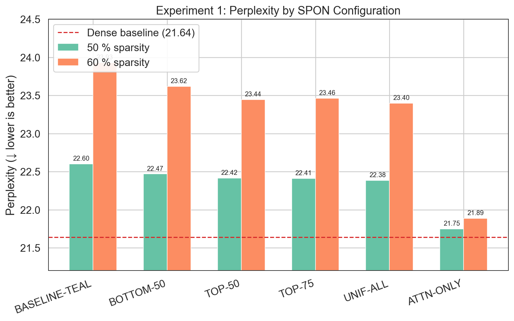
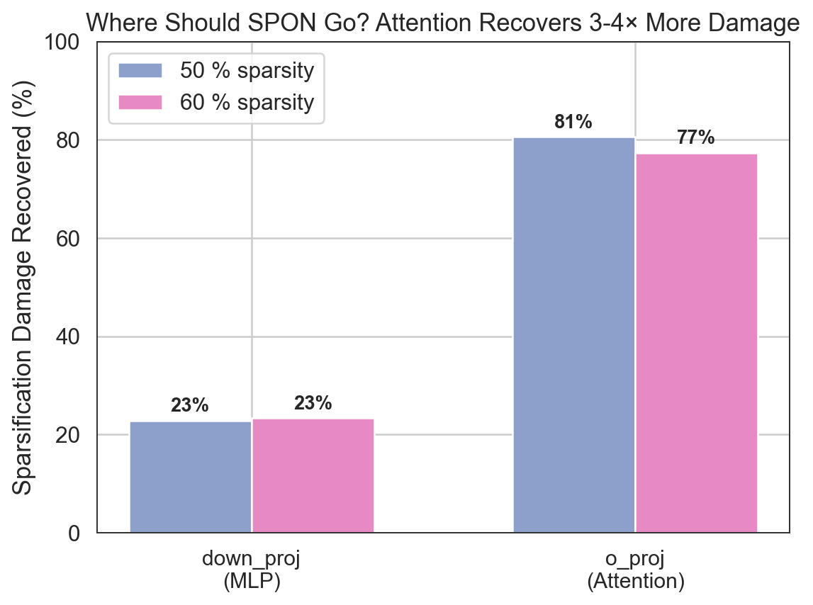
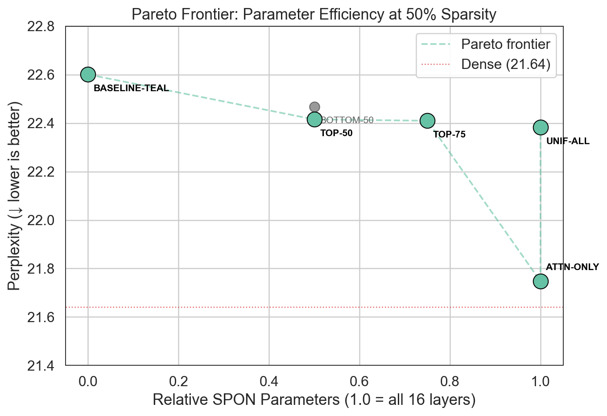
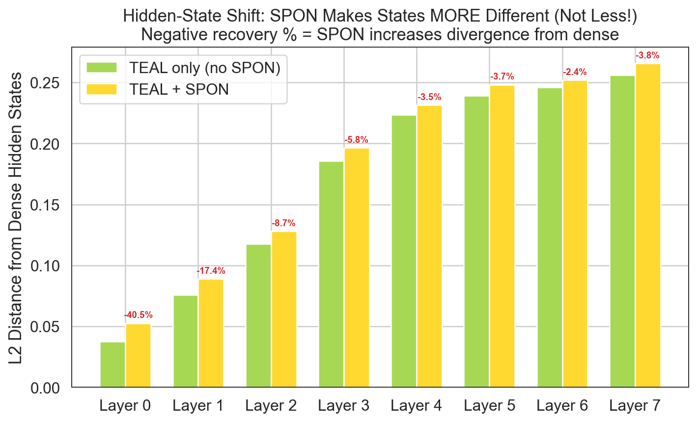

# SPON Extensions

> **Extending "Resting Neurons, Active Insights" (arXiv:2512.12744v1) — Layer-Wise Allocation & Mechanistic Interpretability**

[](https://arxiv.org/abs/2512.12744)
[](LICENSE)

This repository extends the SPON paper by Xu, Gao, Weng & Ma with two new experiments that investigate **where to place SPON biases** and **what those biases encode mechanistically**. All experiments are fully reproducible on a single A100 GPU (~37 minutes).

## Headline Results

| Finding | Result |
|---------|--------|
| **Attention `o_proj` recovers 3-4× more damage than MLP `down_proj`** | 77-80% vs 23% damage recovered |
| **Top-50% of layers capture 85% of the benefit** | Pareto-optimal at half the parameter cost |
| **SPON biases diverge from dense at intermediate layers** | Yet improve final output — distributed correction, not local repair |
| **Different training configs converge to the same biases** | 0.943 avg cosine similarity across shared layers |

See **[FINDINGS.md](FINDINGS.md)** for the full writeup with plots.

---

## Quick Start

### 1. Install

```bash
git clone https://github.com/HetanshWaghela/spon-extension.git
cd spon-extension

# Create environment
python -m venv venv
source venv/bin/activate        # Windows: venv\Scripts\activate

# Install dependencies
pip install -r requirements.txt
```

For gated models (e.g. Meta Llama):
```bash
huggingface-cli login
```

### 2. Verify Setup

```bash
python test_setup.py              # full check (requires GPU)
python test_setup.py --skip-model # skip model download
```

### 3. Run Experiments

**Experiment 1 — Allocation Sweep** (trains 12 configs, ~30 min on A100):
```bash
python experiments/exp1_allocation/run_allocation_sweep.py \
    --model meta-llama/Llama-3.2-1B \
    --configs BASELINE-TEAL UNIF-ALL TOP-50 TOP-75 BOTTOM-50 ATTN-ONLY \
    --sparsity 0.5 0.6 \
    --epochs 10 \
    --dense_baseline \
    --num_calibration_samples 2048 \
    --num_eval_samples 1024 \
    --experiment_name full_sweep \
    --output_dir results
```

**Experiment 2 — Interpretability Analysis** (~7 min on A100):
```bash
python experiments/exp2_interpretability/run_interpretability.py \
    --model meta-llama/Llama-3.2-1B \
    --spon_checkpoint results/allocation_sweep/runs/<run_id>/checkpoints/spon_TOP-50_s0.50.pt \
    --spon_checkpoint_b results/allocation_sweep/runs/<run_id>/checkpoints/spon_UNIF-ALL_s0.50.pt \
    --sparsity 0.5 \
    --output_dir results/interpretability
```

**Generate Figures**:
```bash
python generate_figures.py
```

---

## Research Questions

### Experiment 1: Optimal SPON Allocation

> *Can we achieve equivalent PPL improvement with fewer SPON parameters, and are there better injection sites than `down_proj`?*

We test 6 allocation strategies at 2 sparsity levels:

| Config | Description | Relative Params |
|--------|-------------|----------------|
| `BASELINE-TEAL` | No SPON (sparsification only — control) | 0× |
| `UNIF-ALL` | SPON on all layers `down_proj` (paper baseline) | 1.0× |
| `TOP-50` | SPON on first 50% of layers | 0.5× |
| `TOP-75` | SPON on first 75% of layers | 0.75× |
| `BOTTOM-50` | SPON on last 50% of layers (control) | 0.5× |
| `ATTN-ONLY` | SPON on all layers `o_proj` (attention) | 1.0× |

### Experiment 2: Mechanistic Interpretability

> *What do SPON biases actually encode?*

Six analyses:
1. **PCA alignment** — Do biases align with principal components of hidden states?
2. **Category-specific shifts** — Does SPON affect math/coding/safety prompts differently?
3. **Bias statistics** — Distribution properties (norms, kurtosis, symmetry)
4. **Hidden-state shifts** — Does SPON restore intermediate representations toward dense?
5. **Bias norm ranking** — Which layers need the most correction?
6. **Cross-config comparison** — Do different training configs learn the same biases?

---

## Key Results

### Perplexity Comparison (Llama-3.2-1B, WikiText-103)



| Config | 50% Sparsity PPL | 60% Sparsity PPL |
|--------|------------------|------------------|
| Dense | 21.64 | 21.64 |
| BASELINE-TEAL | 22.60 | 23.93 |
| UNIF-ALL | 22.38 | 23.40 |
| TOP-50 | 22.42 | 23.44 |
| **ATTN-ONLY** | **21.75** | **21.89** |

### Damage Recovery: Attention vs MLP



SPON on attention `o_proj` recovers **77-80%** of sparsification damage. SPON on MLP `down_proj` recovers only **23%**.

### Pareto Frontier



TOP-50 achieves 85% of full-allocation improvement with 50% of parameters.

### Hidden-State Shift Paradox



SPON makes intermediate hidden states *more* different from the dense model (negative recovery), yet improves final output. This reveals an end-to-end distributed correction strategy.

---

## Project Structure

```
spon-extensions/
├── configs/
│   ├── allocation_configs.yaml      # SPON allocation strategies
│   └── training_configs.yaml        # Training hyperparameters
├── src/
│   ├── allocation.py                # SPONConfig, AllocationBuilder
│   ├── sparse_forward.py            # TEAL-style magnitude sparsification
│   ├── spon_trainer.py              # KL-divergence distillation training
│   ├── evaluation.py                # Perplexity & hidden-state metrics
│   └── result_manager.py            # Structured result saving & LaTeX export
├── experiments/
│   ├── exp1_allocation/             # Allocation sweep experiment
│   │   ├── run_allocation_sweep.py  # Main entry point
│   │   ├── layer_importance.py      # Layer sensitivity analysis
│   │   └── visualizations.py        # Exp1-specific plots
│   └── exp2_interpretability/       # Interpretability experiment
│       ├── run_interpretability.py  # Main entry point (6 analyses)
│       └── visualizations.py        # Exp2-specific plots
├── results/
│   ├── allocation_sweep/            # Exp1 results (JSON, CSV, LaTeX, checkpoints)
│   └── interpretability/            # Exp2 results (JSON)
├── figures/                         # Generated plots (7 figures)
├── notebooks/                       # Interactive Jupyter demos
├── generate_figures.py              # Regenerate all plots from results
├── FINDINGS.md                      # Complete experimental findings with figures
├── test_setup.py                    # Environment verification
└── requirements.txt                 # Python dependencies
```

---

## Model Support

| Model | Layers | Hidden Dim | Status |
|-------|--------|-----------|--------|
| Llama-3.2-1B | 16 | 2048 | Primary (all results) |
| Llama-3.2-3B | 28 | 3072 | Validated |
| Llama-3.1-8B | 32 | 4096 | Validated |

---

## Results Directory

After running experiments, results are organized as:

```
results/
├── allocation_sweep/
│   ├── metadata.json                # Experiment metadata
│   ├── runs/
│   │   └── run_<timestamp>/
│   │       ├── summary.json         # Run overview
│   │       ├── results.json         # Per-config perplexity, loss, timing
│   │       ├── metrics.csv          # Training loss curves (per-step)
│   │       ├── config.json          # Hyperparameter snapshot
│   │       └── checkpoints/         # Saved SPON biases (.pt files)
│   ├── aggregated/
│   │   ├── summary.csv              # All results in one table
│   │   ├── pareto.json              # Pareto-optimal configurations
│   │   └── latex_tables/            # Publication-ready LaTeX
│   └── analysis/
│       └── statistics.json          # Aggregated statistics
└── interpretability/
    └── interpretability_<timestamp>.json  # Full Exp2 analysis output
```

---

## API Usage

```python
from src import SPONTrainer, SPONConfig, TrainingArgs

# Configure which layers get SPON biases
config = SPONConfig(
    name="top_half",
    layer_mask=[0, 1, 2, 3, 4, 5, 6, 7],
    modules=["down_proj"]
)

# Train SPON biases via KL distillation
trainer = SPONTrainer(model, config, sparsity=0.5, args=TrainingArgs())
trainer.train(calibration_dataloader)

# Extract trained biases
biases = trainer.get_spon_biases()

# Evaluate
from src import compute_perplexity
result = compute_perplexity(model, eval_dataloader, use_sparse=True)
```

---

## Citation

If you use this code, please cite the original SPON paper:

```bibtex
@article{xu2024spon,
  title={Resting Neurons, Active Insights: Improving Input Sparsification 
         for Large Language Models},
  author={Xu, Haotian and Gao, Tian and Weng, Tsui-Wei and Ma, Tengfei},
  journal={arXiv preprint arXiv:2512.12744},
  year={2025}
}
```

## References

- **SPON Paper**: [arXiv:2512.12744](https://arxiv.org/abs/2512.12744)
- **TEAL**: Training-free Activation Sparsity — [ICLR 2025 Spotlight](https://arxiv.org/abs/2404.15011)
- **Prof. Weng's Lab**: [UCSD Trustworthy ML Lab](https://lilywenglab.github.io/)

## License

Apache 2.0 — see [LICENSE](LICENSE).
